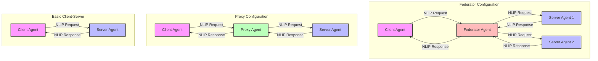
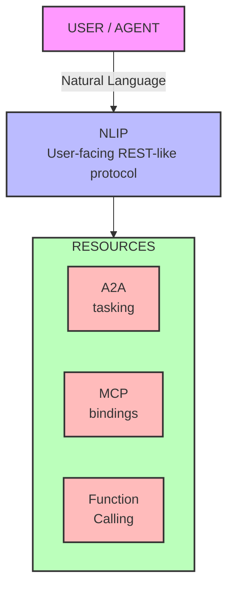
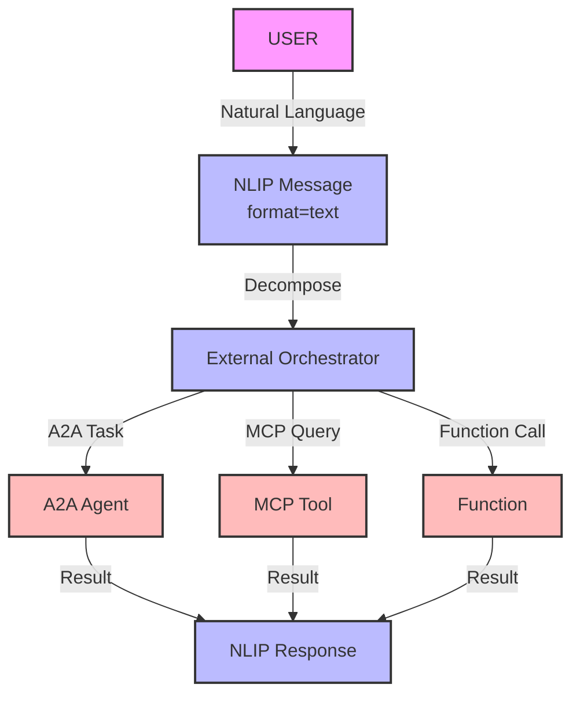
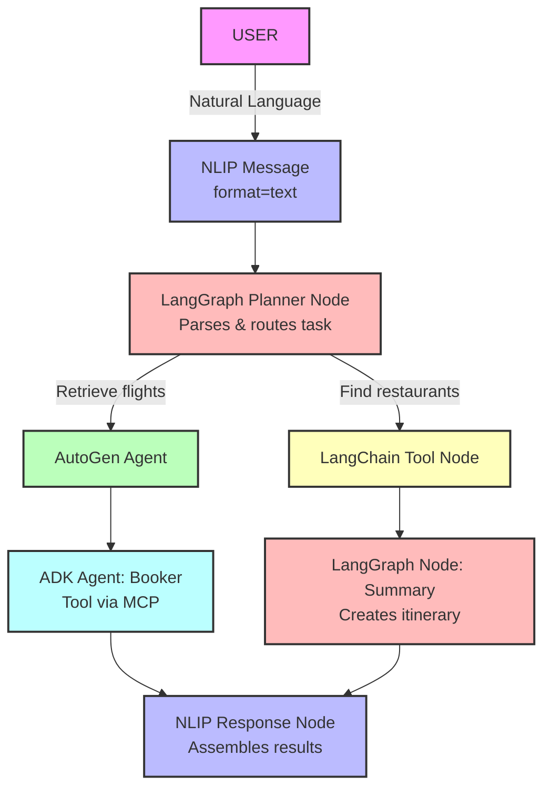

# NLIP: The Universal Protocol for AI System Communication
## RFC Draft

### Abstract
This document describes NLIP (Natural Language Interaction Protocol), a universal interface for AI system communication. NLIP provides a structured message format and deployment model that enables seamless interoperability between different AI frameworks and protocols, while maintaining a clear separation between message structure and orchestration logic.

### Status of This Memo
This is an Internet-Draft. It is inappropriate to use Internet-Drafts as reference material or to cite them other than as "work in progress."

### Table of Contents
1. Introduction
2. Protocol Architecture
3. Protocol Translation
4. Framework Integration
5. Implementation and Adoption
6. Security Considerations
7. IANA Considerations
8. References
9. Authors' Addresses

---

## 1. Introduction

### 1.1 Executive Summary
Today's AI ecosystem is fragmented. Each framework, tool, and service speaks its own language - A2A for agent coordination, MCP for tool binding, Function Calling for structured invocation. This fragmentation forces developers to write custom adapters and glue code, creating brittle systems that are hard to maintain and extend.

NLIP (Natural Language Interaction Protocol) solves this by becoming the REST of AI systems - a universal interface that standardizes how agents, tools, and services represent and exchange information. Just as REST provided a uniform way to interact with web resources, NLIP provides a consistent way to interact with AI resources, regardless of their underlying implementation.

At its core, NLIP is a message-based protocol that sits above specialized protocols like A2A (agent coordination), MCP (tool binding), and Function Calling. It provides a consistent way to:
- Structure natural language requests to any AI resource
- Carry control and format cues that help external orchestrators route messages
- Handle responses in a standardized format
- Support composition of complex operations across different systems

The protocol is designed to be:
- **Transport-agnostic**: Works over any communication channel
- **Model-agnostic**: Compatible with any LLM or AI system
- **Framework-agnostic**: Integrates with any AI framework
- **Future-proof**: New protocols can be added without breaking existing systems

This document explores how NLIP enables seamless interoperability between different AI frameworks and protocols, making it possible to build complex AI applications that leverage the best tools and services from across the ecosystem.

### 1.2 The Original NLIP Proposal
NLIP was originally proposed in the [AAAI Workshop specification](https://github.com/nlip-project/documents/blob/main/NLIP_Specification.pdf), which formalized its message schema, resource model, and deployment strategies. The specification presents NLIP's use in fundamental deployment topologies:



The specification defines NLIP as a transport-agnostic, model-agnostic, structured interface between communicating agents. It serves as the canonical reference for understanding NLIP's role in the AI protocol stack.

What makes NLIP uniquely valuable is its position in the protocol stack. While other protocols like A2A, MCP, and Function Calling each solve specific problems (agent coordination, tool binding, and structured invocation respectively), NLIP operates at a higher level of abstraction. It's not just another protocol - it's the universal interface that enables these specialized protocols to work together seamlessly. This orthogonal positioning is what allows NLIP to solve a fundamental challenge in today's AI ecosystem.

Building on this foundation, we've expanded NLIP's role to address a broader challenge in today's AI ecosystem. While the original specification focused on agent-to-agent communication, we've discovered that NLIP's structured message format and transport-agnostic design make it uniquely suited to solve a more fundamental problem: the fragmentation of AI protocols and frameworks.

### 1.3 The Problem: AI System Fragmentation
As described in the Executive Summary, the AI ecosystem faces significant fragmentation across protocols and frameworks. This section explores the specific challenges this creates for developers and system architects.

### 1.4 Core Design Principles
The design principles introduced in the Executive Summary - transport-agnostic, model-agnostic, framework-agnostic, and future-proof - form the foundation of NLIP's architecture. This section explores how these principles are implemented in practice.

---

## 2. Protocol Architecture

### 2.1 Protocol Stack


This diagram illustrates NLIP's position in the protocol stack, showing how it provides a unified interface above specialized protocols while maintaining direct access to resources.

### 2.2 Protocol Roles
| Layer                    | Purpose                                       | Example Usage                         |
|--------------------------|-----------------------------------------------|----------------------------------------|
| **NLIP**                | Semantic interface for resource interaction   | "Book me a flight to Tokyo" → any backend |
| **A2A**                 | Task negotiation and delegation between agents| Planner agent assigns to executor agent|
| **MCP**                 | Secure tool/data binding in model context     | Claude or Claude-like model calling live tools|
| **Function Calling**    | Structured function invocation from LLM       | OpenAI's `functions` or `tools` APIs   |

This table shows how each protocol layer serves a distinct purpose while NLIP provides the semantic interface that unifies them.

---

## 3. Protocol Translation

### 3.1 Single Protocol Translation

NLIP enables seamless translation between natural language and various AI protocols. Here are key examples:

1. **Natural Language to A2A Task**
   ```
   User: "Find me a flight to Tokyo next week"
   ↓
   NLIP Message:
   {
     "format": "text",
     "subformat": "en",
     "content": "Find me a flight to Tokyo next week",
     "control": "task"
   }
   ↓
   A2A Task:
   {
     "task_type": "flight_search",
     "parameters": {
       "destination": "Tokyo",
       "timeframe": "next_week"
     }
   }
   ```

2. **Natural Language to MCP Tool Binding**
   ```
   User: "What's the weather in San Francisco?"
   ↓
   NLIP Message:
   {
     "format": "text",
     "subformat": "en",
     "content": "What's the weather in San Francisco?",
     "control": "query"
   }
   ↓
   MCP Binding:
   {
     "tool": "weather_api",
     "parameters": {
       "location": "San Francisco"
     },
     "context": "user_weather_query"
   }
   ```

3. **Natural Language to Function Call**
   ```
   User: "Calculate the square root of 144"
   ↓
   NLIP Message:
   {
     "format": "text",
     "subformat": "en",
     "content": "Calculate the square root of 144",
     "control": "compute"
   }
   ↓
   Function Call:
   {
     "name": "math_sqrt",
     "arguments": {
       "number": 144
     }
   }
   ```

### 3.2 Multi-Protocol Support



This diagram shows how NLIP messages carry the necessary control and format information to enable external orchestrators to route requests appropriately. NLIP itself does not perform orchestration but provides the structural support for it.

Key Features of Multi-Protocol Support:

1. **Protocol Agnosticism**
   - NLIP messages can be routed to any protocol
   - Each protocol can handle messages in its preferred format
   - New protocols can be added without changing the message structure

2. **State Management Support**
   - `token` field enables state tracking
   - `submessages` support task decomposition
   - `control` field indicates message purpose

3. **Result Composition Support**
   - Structured response format
   - Nested submessages for complex results
   - Consistent error handling

4. **Error Handling Support**
   - Standardized error reporting
   - Protocol-specific error recovery
   - Consistent status codes

### 3.3 Framework Integration

#### 3.3.1 Single Framework Integration: LangChain Example

The following diagrams show LangChain's message flow both with and without NLIP, highlighting the benefits of NLIP integration:

```mermaid
graph TD
    subgraph "LangChain With NLIP"
        U2[USER sends NLIP msg<br/>format=text, subformat=en] --> P[PromptChain<br/>Applies templating<br/>to NLIP content]
        P --> R2[NLIP ToolRouter<br/>Uses control, format<br/>to dispatch]
        R2 -->|format=structured| T3[Tool A: WebSearch<br/>Returns structured data]
        R2 -->|format=binary| T4[Tool B: PDFGen<br/>Returns binary data]
        T3 --> M2[MemoryChain<br/>Uses token, submessages<br/>for state tracking]
        T4 --> M2
        M2 --> O[NLIP Output Composer<br/>Collects submessages<br/>into response]
    end

    subgraph "LangChain Without NLIP"
        U1[USER INPUT<br/>Raw string prompt<br/>No structure] --> L1[LLM Chain<br/>Uses prompt templates<br/>Outputs string]
        L1 --> R1[Tool Router<br/>Selects tool/function<br/>from list]
        R1 -->|string| T1[Tool A<br/>Returns string<br/>or custom JSON]
        R1 -->|string| T2[Tool B<br/>Returns string<br/>or custom JSON]
        T1 --> M1[Memory or Output<br/>Optional state<br/>tracking]
        T2 --> M1
    end

    classDef user fill:#f9f,stroke:#333,stroke-width:2px
    classDef chain fill:#bfb,stroke:#333,stroke-width:2px
    classDef router fill:#fbb,stroke:#333,stroke-width:2px
    classDef tool fill:#ffb,stroke:#333,stroke-width:2px
    classDef memory fill:#bff,stroke:#333,stroke-width:2px
    classDef nlip fill:#bbf,stroke:#333,stroke-width:2px

    class U1,U2 user
    class L1,P chain
    class R1,R2 router
    class T1,T2,T3,T4 tool
    class M1,M2 memory
    class O nlip
```



This comparison highlights how NLIP's structured message format enables more robust tool integration, state management, and error handling compared to traditional string-based approaches.

#### 3.3.2 Cross-Framework Integration



This diagram shows how NLIP enables different frameworks to work together seamlessly, with each framework handling specific aspects of the task while maintaining a consistent message flow.

### 3.4 Framework Comparison

| Framework        | How NLIP Fits Into It                                     | How It Fits Into NLIP                                     |
|------------------|------------------------------------------------------------|-------------------------------------------------------------|
| Google ADK       | User/agent I/O and inter-agent messaging                   | ADK agents can be NLIP Resources (URI, capabilities)        |
| Microsoft AutoGen| Transport layer between collaborating agents               | AutoGen agents can expose/consume NLIP messages             |
| LangChain        | NLIP wraps input/output to tools, memory, and chains       | Tools act as structured NLIP responders                    |
| LangGraph        | NLIP routes and formats messages between graph nodes       | Nodes are resource handlers with typed NLIP message flows  |

This table illustrates how NLIP's universal interface enables each framework to maintain its unique strengths while interoperating through a shared message contract.

---

## 4. NLIP in Practice

### 4.1 Model Integration
If Claude adopted NLIP, its tool calling system could:
- Handle any NLIP-compatible tool without custom adapters
- Process requests from any NLIP-aware framework
- Maintain state across tool invocations using NLIP's token system
- Return structured responses that other systems can process

### 4.2 Framework Integration
AutoGen agents could act as NLIP-compatible responders by:
- Exposing their capabilities through NLIP resource descriptions
- Processing NLIP messages directly without format conversion
- Composing responses that maintain relationships between results
- Handling errors consistently across different tool types

### 4.3 Cross-Protocol Orchestration
A travel planning system could use NLIP to:
- Convert natural language requests into A2A tasks for agent coordination
- Bind to weather APIs via MCP for real-time data
- Call specialized functions for flight searches
- Compose results into a unified itinerary

### 4.4 Framework Interoperability
LangChain and LangGraph could interoperate through NLIP by:
- Sharing tools and memory systems without custom adapters
- Maintaining state across framework boundaries
- Handling errors consistently
- Preserving message structure and relationships

NLIP offers significant advantages to popular agentic frameworks by providing a portable, structured messaging layer that supports orchestration through well-defined control and content fields—though it does not orchestrate execution itself.

## 5. Implementation and Adoption

### 5.1 REST ↔ NLIP Analogy

| REST Concept           | NLIP Equivalent                           |
|------------------------|-------------------------------------------|
| HTTP verbs             | `control`                                 |
| MIME types             | `format` / `subformat`                    |
| URL / endpoint         | `token`, `resource`, or `submessage`      |
| Query parameters       | `content` (structured or text)            |
| Response headers       | `control` metadata                        |
| Response body          | `content` or nested `submessages`         |
| Status codes           | `control.status`                          |
| Content negotiation    | `format` preference or fallback behavior  |
| Authentication         | `control.auth`, `token` references        |
| Caching                | `token` or persistent `resource` binding  |

This analogy serves two key purposes:

1. **Developer Familiarity**: By mapping to well-understood REST concepts, NLIP becomes immediately accessible to developers who already understand web APIs. The familiar patterns (verbs, content types, endpoints) make it easier to grasp NLIP's design.

2. **Protocol Evolution**: The analogy shows how NLIP extends REST principles for AI systems. While REST was designed for web resources, NLIP applies similar patterns to AI resources (agents, tools, models) while adding AI-specific capabilities like format awareness and state management.

The key insight is that just as REST provided a universal interface for web resources, NLIP provides a universal interface for AI resources - but with the semantic richness needed for AI interactions.

## 6. Security Considerations
NLIP's security model is based on its transport-agnostic design, allowing security to be implemented at the appropriate layer. The protocol supports authentication through the `control.auth` field and token-based security context. Implementations should consider:
- Message integrity and confidentiality
- Access control and authorization
- Secure token management
- Protocol-specific security requirements

## 7. IANA Considerations
This document has no IANA actions.

## 8. References

### 8.1 Normative References
- [First Draft of proposed standard ECMA TC-56 NLIP, Natural Language Interaction Protocol](https://github.com/nlip-project/ecma_draft1)  
  Officially maintained draft specification from the NLIP project GitHub repository.

- [Model Context Protocol (MCP) by Anthropic](https://www.anthropic.com/news/model-context-protocol)  
  Official announcement and overview of the Model Context Protocol by Anthropic.

- [Agent-to-Agent Protocol (A2A) by Google](https://developers.googleblog.com/en/a2a-a-new-era-of-agent-interoperability/)  
  Official Google blog post introducing the Agent-to-Agent (A2A) protocol.

### 8.2 Informative References
- [LangChain Documentation](https://python.langchain.com/docs/introduction/)  
  Official documentation for the LangChain framework.

- [AutoGen Documentation](https://microsoft.github.io/autogen/0.2/docs/Getting-Started/)  
  Official documentation for the AutoGen agent framework.

- [LangGraph Documentation](https://www.langchain.com/langgraph)  
  Official documentation for the LangGraph framework.

- [Google Agent Development Kit (ADK)](https://google.github.io/adk-docs/)  
  Official documentation for Google's Agent Development Kit.

## 9. Authors' Addresses

Christopher Nguyen  
Aitomatic, Inc.  
Email: ctn@aitomatic.com

Sean Hughes  
ServiceNow, Inc.
Email: sean.hughes@servicenow.com

Tom Sheffler  
ECMA  
Email: tom.sheffler@gmail.com
