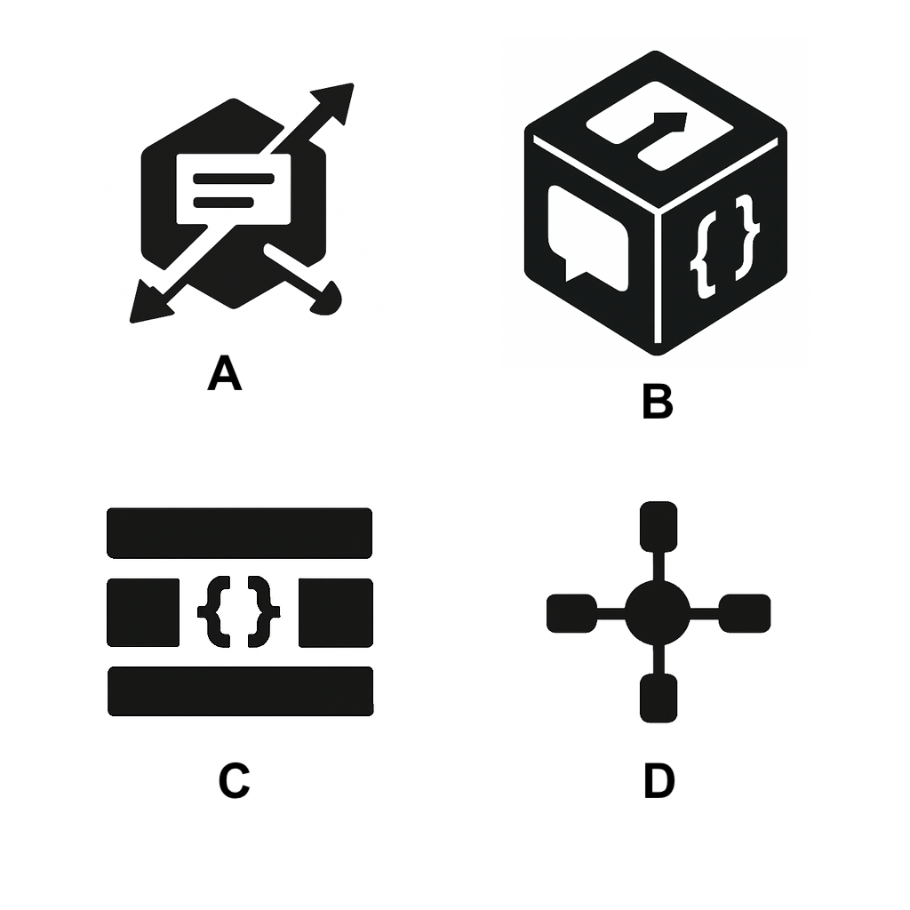

# Proposed NLIP Logos

This document presents the proposed logo options for the Natural Language Interface Protocol (NLIP) project, with detailed explanations of their design intent and meaning in the context of AI agents and the agentic internet.

## Logo Options

The following image contains several proposed logo designs for consideration:

## Detailed Explanations

### A. The Diagonal Arrows + Bubble in Hex

**Motivation:**
Captures **conversion or flow** between natural language and structured commands inside a networked system. The hexagon suggests a **technical protocol layer** or infrastructure.

**Statement:**
> "NLIP transforms natural language into structured protocol in a connected agentic world."

### B. The 3D Cube with Symbols

**Motivation:**
Each face represents a **facet of interaction**: natural language (`🗨`), logic (`{}`), and directional flow (`↔`). The cube implies **modularity, structure, and standardization** — key to protocol design.

**Statement:**
> "NLIP is the universal building block for interfacing agents, logic, and tools."

### C. The Minimal Bracket Emblem

**Motivation:**
A stark `{}` shape symbolizes **structure and parsing** — the skeletal syntax behind communication. It reduces NLIP to its essence: **standardized, structured meaning**.

**Statement:**
> "NLIP brings syntax to the chaos — language, formalized."

### D. The Node and Spokes

**Motivation:**
A central node distributing to multiple endpoints — visual metaphor for **interoperability** and **hub-spoke orchestration** among diverse AI frameworks.

**Statement:**
> "NLIP is the protocol hub that connects all agents into one ecosystem."

## Design Considerations

When evaluating the logo options, please consider:
- Clarity and recognizability
- Scalability for different use cases
- Representation of NLIP's core mission
- Professional appearance
- Versatility across different platforms and media 